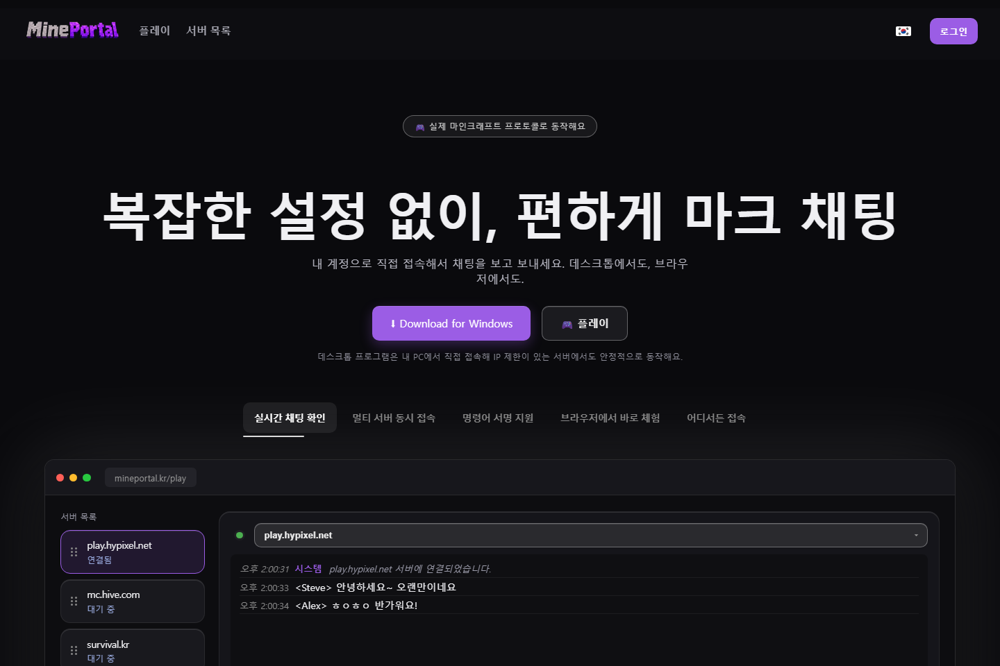
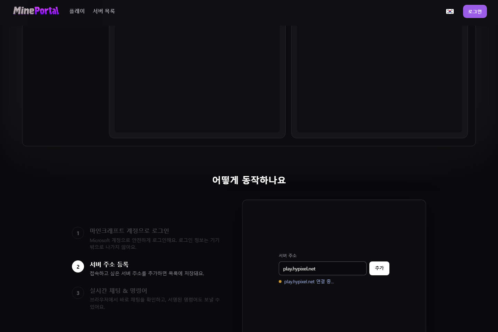
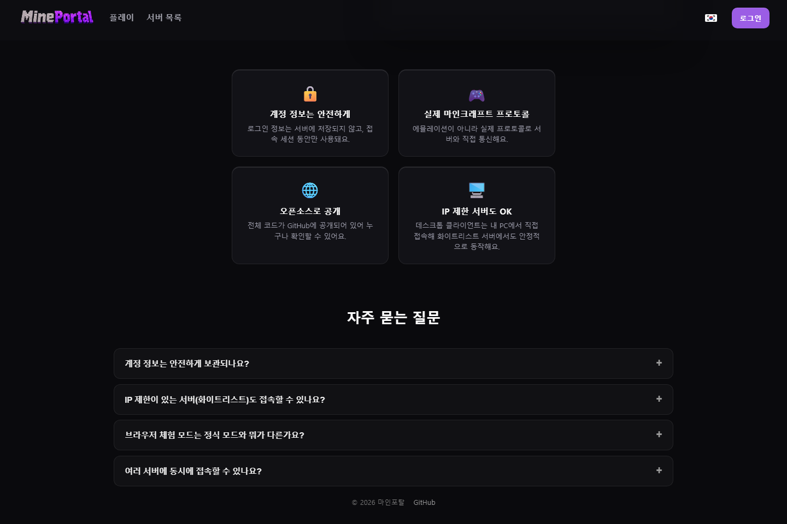

# 마인포탈 (MinePortal)

브라우저에서 로그인 한 번으로 실제 마인크래프트 서버에 접속해서 채팅을 보고 보낼 수 있는
웹 서비스예요. 클라이언트 설치 없이 브라우저에서 바로 체험할 수 있고, IP가 안정적으로
고정되어야 하는 서버(화이트리스트 서버 등)를 위한 데스크톱 클라이언트도 제공해요. 실제
서비스는 [mineportal.kr](https://mineportal.kr)에서 운영 중이에요.

<p align="center">
  
</p>
<p align="center">
  
  
</p>

## 이게 어떤 서비스인가요

마인크래프트는 원래 전용 런처/클라이언트를 설치해야만 서버에 접속하고 채팅을 볼 수 있어요.
마인포탈은 그 과정을 걷어내고, **Microsoft 계정으로 로그인만 하면 브라우저에서 여러 서버의
채팅을 동시에 보고, 보내고, 명령어까지 칠 수 있게** 해주는 서비스예요.

- 서버 주소를 등록해두면 여러 서버에 동시 접속해서 각 서버의 채팅을 그리드로 한눈에 볼 수
  있어요.
- 채팅뿐 아니라 서버가 지원하는 명령어(`/msg`, `/tpa` 등)도 텍스트로 그대로 보낼 수 있어요.
- 로그인 정보(Microsoft 계정 토큰)는 서버에 영구 저장하지 않고 접속 세션 동안만 사용해요.
- 접속은 에뮬레이션이 아니라 실제 마인크래프트 프로토콜로 이루어져서, 서버 입장에서는
  일반 클라이언트가 접속한 것과 동일하게 보여요.

## 기술적으로 어떻게 동작하나요 (TCP 관점)

마인크래프트 서버는 기본적으로 TCP 소켓 위에서 자체 바이너리 프로토콜(로그인 → 상태 →
플레이 패킷 스트림)로 통신해요. 브라우저는 임의의 TCP 소켓을 직접 열 수 없기 때문에,
마인포탈은 "누가 그 TCP 연결을 실제로 여는가"에 따라 두 가지 접속 모드를 제공해요.

1. **체험 모드 (브라우저만, 서버 릴레이)**
   `server/`(Spring Boot 백엔드)가 [MCProtocolLib](https://github.com/GeyserMC/MCProtocolLib)로
   대상 마인크래프트 서버와 **직접 TCP 연결**을 맺어요. 브라우저는 이 TCP 연결에 손댈 수
   없으니, 백엔드가 그 TCP 스트림에서 오가는 패킷(채팅 메시지, 명령어 등)을 다시 브라우저와의
   **WebSocket 연결**로 중계(relay)해줘요. 즉 `브라우저 ⇄ WebSocket ⇄ 백엔드 ⇄ TCP ⇄
   마인크래프트 서버` 구조예요. 설치가 필요 없어 바로 체험할 수 있지만, 여러 사용자가 백엔드를
   통해 접속하면 서버 입장에서는 "같은 IP(백엔드 서버 IP)에서 여러 접속"으로 보일 수 있어
   IP 제한/화이트리스트 서버에서는 밴 위험이 있어요.

2. **정식 모드 (데스크톱 클라이언트, 직접 연결)**
   `desktop-client/`(Java 트레이 앱)를 사용자 PC에 설치하면, TCP 연결을 **백엔드가 아니라
   사용자 PC 자신이** 대상 마인크래프트 서버와 직접 맺어요. 데스크톱 앱은 화면이 따로 없는
   트레이 상주 프로그램이고, 로그인·서버 목록·채팅 UI는 전부 웹(mineportal.kr)에 있어요.
   웹이 WebSocket으로 "이 서버에 접속해줘 / 이 메시지를 보내줘" 같은 명령을 백엔드를 거쳐
   데스크톱 앱에 내려보내면, 데스크톱 앱이 그 명령을 받아 **사용자 실IP로** 실제 TCP 접속과
   패킷 송수신을 대신 수행해요. 그래서 서버 입장에서는 매번 다른(각 사용자의) IP에서 접속한
   것으로 보이고, IP 제한이 있는 서버에서도 안정적으로 동작해요.

두 모드 모두 마인크래프트의 실제 로그인·채팅 프로토콜을 그대로 구현해요 — 채팅을 검증 없이
그냥 흉내 내는 게 아니라, secure-chat을 요구하는 서버를 위해 Mojang의 player-certificates
엔드포인트에서 RSA 키 쌍을 받아 매 채팅 메시지에 실제로 서명해서 보내요
(`server/.../connection/McConnectionManager.java`, 데스크톱 클라이언트도 동일 로직을
독립적으로 구현). 명령어 인자 중 서버의 Brigadier 명령 트리가 채팅으로 취급하는 부분
(`CommandParser.MESSAGE`)도 같은 방식으로 서명돼요.

## 아키텍처

| 경로 | 설명 |
| --- | --- |
| `server/` | Spring Boot 백엔드. 계정/서버 목록 상태를 관리하고, 채팅을 WebSocket으로 중계하며, 체험 모드에서는 MCProtocolLib로 직접 마인크래프트 서버에 TCP 접속한다. |
| `client/` | 프론트엔드 전체 — 빌드 없는 정적 파일 하나(`client/index.html`). 백엔드가 그대로 서빙해서 `mineportal.kr`에 배포된다. |
| `desktop-client/` | 사용자 PC에서 직접 접속하는 Java 트레이 앱(백엔드 릴레이를 거치지 않음). IP 제한/화이트리스트 서버에서도 "같은 IP 다중 접속" 밴 위험 없이 안정적으로 동작한다. |
| `toss-client/` | [토스 앱인토스](https://toss.im) 미니앱 래퍼(`@apps-in-toss/web-framework` + `ait` CLI). `mineportal.kr`을 토스 플랫폼 네이티브 셸 안에 그대로 담는다. |
| `.github/workflows/` | `deploy.yml`은 `main`에 push될 때마다 SSH로 접속해 `docker compose`를 재빌드해 자동 배포한다. `toss-deploy.yml`은 앱인토스 `.ait` 번들을 빌드/배포하는 수동 트리거 워크플로다. |

## 배포

`main`에 push하면 자동으로 `mineportal.kr`에 배포돼요 — `deploy.yml`이 운영 호스트에 SSH로
접속해서 `origin/main`으로 리셋하고 `docker compose` 스택을 재빌드해요. 스테이징 환경이
없어서 `client/`나 `server/`를 고치면 `main`에 반영되는 즉시 실서비스에 나가요.

앱인토스 미니앱은 별도로, 필요할 때만 배포해요: Actions 탭에서 **Deploy App in Toss**
워크플로(`toss-deploy.yml`)를 수동 실행하면 되고, `APPS_IN_TOSS_API_KEY` 레포 시크릿이
필요해요.

## 로컬 실행

```bash
cp server/.env.example server/.env
cd server && ./gradlew bootRun
```

http://localhost:3000 을 열면 돼요 — 백엔드가 `client/index.html`을 그대로 서빙해요.

## 클라이언트 (`client/index.html`)

마케팅 홈페이지, 로그인/계정 흐름, 서버 목록, 멀티 서버 채팅 그리드까지 사이트의 모든 것이
이 파일 하나에 들어있고, 페이지 내 i18n 딕셔너리(`data-i18n` 속성 + `lang`/`t()` 헬퍼)로
한/영을 번역해요. 빌드 단계가 없어서 파일을 고치면 그게 곧 배포되는 결과물이에요.

홈페이지 섹션 구성 (위에서 아래로):
- **히어로** — 헤드라인, 다운로드/체험 CTA, 자동으로 순환하는 기능 탭 행(탭 행 전체를
  가로지르는 채움 바가 각 탭에 도달할 때마다 활성 탭을 넘겨줌)과 Play 탭을 흉내 낸 실시간
  느낌의 데모 창 목업.
- **어떻게 동작하나요** — 왼쪽에 3단계가 쌓여 있고(활성 = 흰색, 나머지는 투명도로 흐리게),
  가짜 원형 커서가 오른쪽 미리보기에서 각 단계의 동작을 이동하며 "클릭"해요(Microsoft
  로그인 → 서버 추가·접속 → 채팅 전송·명령어 사용). 해당 단계의 미니 애니메이션이 끝나야
  다음 단계로 넘어가요.
- **신뢰 포인트** — 계정 안전성, 실제 프로토콜, 오픈소스, IP 제한 서버 지원을 담은 4카드
  그리드.
- **FAQ** — 한 번에 하나만 펼쳐지는 아코디언.

Play 탭: 왼쪽 사이드바(서버 탐색 링크 + 서버 목록)는 토글 버튼으로 얇은 스트립으로 접을 수
있고, 사이드바-채팅 패널 사이의 수동 드래그 리사이즈 핸들과는 독립적으로 동작해요.

시각적 스타일은 앱 전체에 일관되게 적용된 "liquid glass" 처리예요 — 반투명
`backdrop-filter` 표면에 은은한 상단 인셋 하이라이트를 준 것으로, `:root`의
`--glass-blur` / `--glass-highlight` CSS 커스텀 프로퍼티로 공유돼요.

## 로그인과 접속 모드

체험 모드(데스크톱 클라이언트 없음)는 백엔드를 통해 접속을 중계하기 때문에 브라우저에서
바로 사용할 수 있지만, 서버 입장에서는 "같은 IP에서 다중 접속"으로 보여 밴 위험이 있어요.
정식 모드는 데스크톱 클라이언트가 로컬에서 실행 중이어야 하고, 사용자 PC에서 직접 접속하기
때문에 그 위험이 없고 IP 제한 서버에서도 동작해요.
